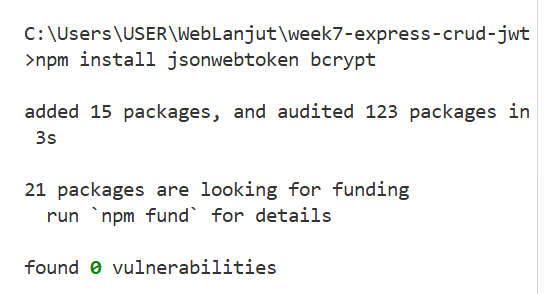
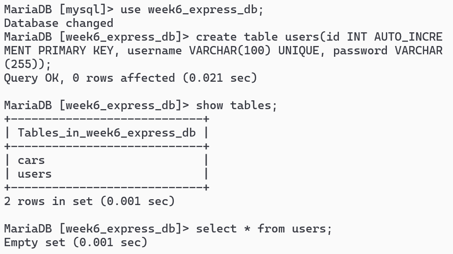
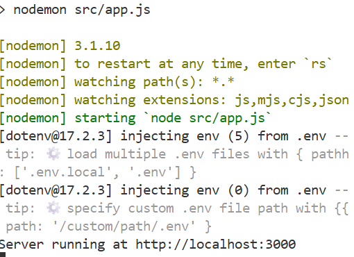
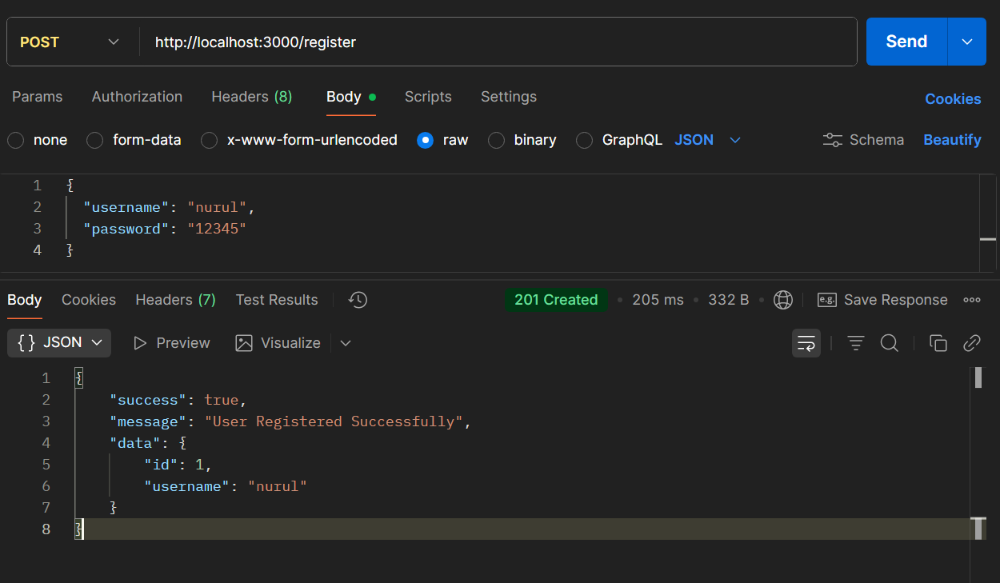
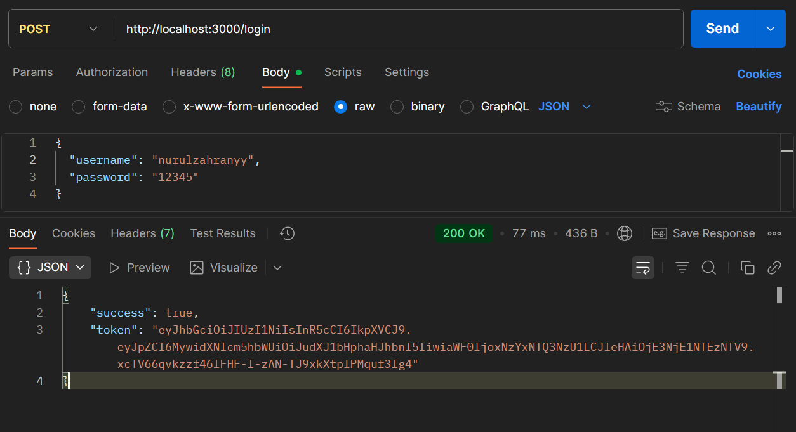
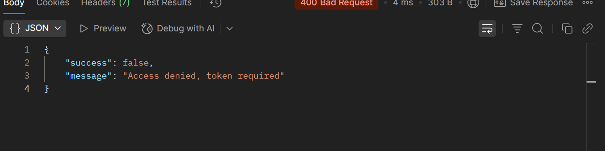
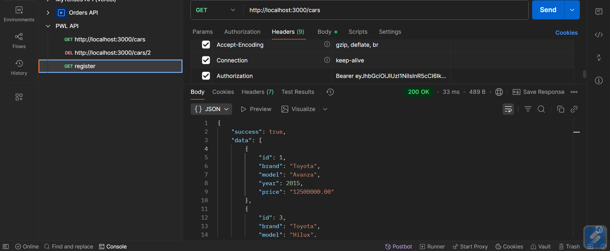

# **WEEK7 – EXPRESS CRUD JWT AUTH**

Mini Project – Pemrograman Web Lanjut B  
> REST API sederhana menggunakan **Express.js**, **MySQL**, dan **JWT Authentication**  

---

## 👩‍💻 **By**
**Nurul Qalbi Zahrani**  
**F1D022150**

---

## 🚀 **Deskripsi Singkat**
Project ini merupakan implementasi REST API menggunakan **Express.js** dan **MySQL**, dilengkapi fitur **JWT Authentication** untuk keamanan akses data.
Sistem ini memungkinkan pengguna melakukan **Register**, **Login**, dan mengelola data dengan mekanisme **CRUD**, yang hanya dapat diakses jika pengguna memiliki **token valid**.

---
## **Fitur Utama**

1. Register & Login User dengan password hashing menggunakan bcrypt.
2. CRUD (Create, Read, Update, Delete) untuk data pengguna atau entitas lain (contoh: order).
3. Proteksi Route menggunakan JWT, sehingga hanya pengguna dengan token valid yang dapat mengakses endpoint tertentu.
4. Middleware tambahan seperti logging dan error handling untuk manajemen server yang lebih baik.

🧩 Struktur Folder
---
## 🧩 **Struktur Folder**
WEEK7-EXPRESS-CRUD-JWT/
│
├── src/
│   ├── controllers/
│   │   └── authController.js
│   │
│   ├── middleware/
│   │   ├── authenticateToken.js
│   │   ├── log.js
│   │   └── errorHandler.js
│   │
│   ├── models/
│   │   └── orderModel.js
│   │
│   └── routes/
│       └── authRoutes.js
│
├── .env
├── .gitignore
├── api.http
├── package.json
├── package-lock.json
└── README.md


## ⚙️ **Langkah Instalasi**

### 1️⃣ Clone Repository
```bash
git clone https://github.com/<username>/week7-express-crud-jwt.git
cd week7-express-crud-jwt
```

### Install Dependencies
npm install express mysql2 dotenv jsonwebtoken bcrypt nodemon
install jsonwebtoken dan bcrypt


### Jalankan Server
npm run dev

## HASIL

### create table


### npm run dev


### uji coba postman POST register


Data berhasil disimpan ke database; password tidak disimpan dalam bentuk teks asli (plain text), melainkan dalam bentuk hash.

### uji coba postman POST login


Kredensial cocok. Server menghasilkan access token yang berisi payload user, ditandatangani dengan secret key. Token ini digunakan untuk mengakses route priva

### message sebelum ditambahkan headers authorization


Middleware authenticateToken memblokir request dan mengembalikan status 401 Unauthorized, menandakan permintaan tidak memiliki token valid.

### setelah ditambahkan header + token


Token diverifikasi menggunakan jwt.verify(). Jika valid, middleware melanjutkan ke controller dan data dari database dikembalikan sebagai response JSON.

## 🧭 Kesimpulan

Dengan dibuatnya REST API ini, pengelolaan data dan autentikasi pengguna menjadi lebih aman dan efisien.
Proyek ini menunjukkan penerapan konsep CRUD, MVC, serta JWT Authentication menggunakan Express.js dan MySQL dengan struktur yang rapi dan mudah dikembangkan lebih lanjut.

